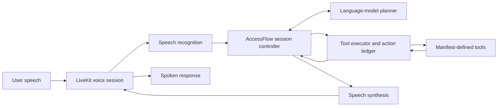

# AccessFlow

**A voice agent that lets people finish, change their minds, and interrupt.**

AccessFlow handles spoken requests as conversations: users can pause, correct a detail,
or interrupt a reply while the agent maintains the current task and its confirmed actions.
It combines a session controller with speech recognition, language-model planning,
and asynchronous tools to keep outdated requests from becoming incorrect results.

Built for **Samsung PRISM GenAI Hackathon — Theme 5: Interruptible Real-time Agents**.

[Demo video folder](https://drive.google.com/drive/folders/1s51DDXuR4_SMGKm-kzsKJsFzk4edWE_H?usp=drive_link)
 · [Evaluation and reproduction](docs/FDB_REPRODUCTION.md)
 · [Architecture and contracts](docs/CONTRACT.md)

## What it does

- **Voice conversations:** LiveKit carries microphone input and spoken replies; users can
  interrupt without submitting each turn with a button.
- **Corrections with context:** Revised requests update the relevant session details while
  preserving information that still applies.
- **Action safety:** Dependency tracking, cancellation, stale-result rejection and an
  action ledger prevent obsolete or duplicate tool results from being treated as current.
- **Clear stop behavior:** An explicit stop-speaking request differs from canceling an action.
  An ambiguous stop request asks for clarification rather than guessing.
- **Tools supplied by manifests:** The controller validates tool arguments and resolves
  supplied capabilities rather than assuming a fixed set of tool names.
- **Isolated sessions:** Each voice room starts with fresh conversational state.

AccessFlow uses pretrained models. Its contribution is conversation control, state and
execution safety, tool integration, and the voice runtime; it does not train a foundation model.

## Architecture



The controller owns authoritative session state. Perception, planning and tools execute
asynchronously. Corrections invalidate dependent work; late responses must match the
current dependencies before they can be accepted. A canceled operation is not automatically
a rollback: committed effects and uncertain write outcomes must be handled explicitly.

### Voice runtime

| Component | Configured backend |
|---|---|
| Audio transport | LiveKit |
| Speech recognition | Groq `whisper-large-v3` |
| Planning | LiveKit Inference `openai/gpt-5.6-luna` |
| Speech output | LiveKit Inference `deepgram/aura-2` |
| Speech activity | Silero VAD |
| State and tool orchestration | AccessFlow Python controller |

The benchmark judge is a separate evaluation dependency, not the agent's planner.
Provider settings and private API credentials are documented in the
[voice adapter setup](src/accessflow/perception/fdb_v3/README.md).

## Extension: destination changes by voice

The extension applies the same controller and voice runtime to a simulated in-car trip.
A user can change the destination, interrupt a reply, or clarify a stop request. Confirmed
changes appear on a browser dashboard backed by the room's local state.

The destination catalog contains **Central Station**, **City Hospital**, and
**Airport Terminal 1**. Unknown places require clarification. A new room starts a new trip.
This is a destination-state simulation: it does not control a vehicle, calculate routes,
use GPS, or provide travel estimates. It uses a separate tool catalog from the benchmark.

The implementation includes `demo/navigation.html`, its FastAPI display, and
`accessflow.perception.navigation_agent`. A polished frontend is not required to run
benchmark evaluation.

## Install and run

Use **Python 3.11**, Git, and `uv`. From a repository checkout:

```powershell
git clone https://github.com/MridulNegi2005/AccessFlow.git
cd AccessFlow
uv sync --frozen --extra fdb
```

Configure the LiveKit project URL, API key and secret, plus the Groq key, in a private
file outside Git. Never put provider secrets in the browser or the repository.
The benchmark worker additionally requires the pinned FDB-v3 reference and released corpus;
follow [FDB setup](docs/FDB_REPRODUCTION.md) before starting it:

```powershell
$env:FDB_V3_ROOT = 'C:\FDB-reference\v3'
uv run --frozen --extra fdb python -m accessflow.perception.fdb_v3.agent check
uv run --frozen --extra fdb python -m accessflow.perception.fdb_v3.agent dev
```

For the separate navigation extension, stop the benchmark worker first because both use
unnamed LiveKit dispatch. Start the extension and display in separate terminals:

```powershell
# Terminal 1: voice worker
$env:NAV_ENV_FILE = 'C:\private\accessflow.env'
$env:NAV_STATE_DB = 'C:\private\navigation.sqlite3'
uv run --frozen --extra fdb python -m accessflow.perception.navigation_agent dev
```

```powershell
# Terminal 2: dashboard, using the same state database
$env:NAV_STATE_DB = 'C:\private\navigation.sqlite3'
uv run --frozen --extra fdb python -m uvicorn demo.navigation_app:app --host 127.0.0.1 --port 8011
```

Connect a microphone client to a fresh room in the same LiveKit project, then open
`http://127.0.0.1:8011/?room=YOUR_ROOM_NAME`. The dashboard displays state; it does not
itself create the room or capture microphone audio. See the
[extension instructions](src/accessflow/perception/fdb_v3/README.md#separate-in-car-destination-extension).

## Evaluation

The current submission interface is **Full-Duplex-Bench v3 over LiveKit**. The released set
contains 100 human recordings across 79 scenarios, 12 speakers, 12 tools and four domains.
The worker integrates the official mock tools without loading benchmark answers into
its planner. The older asynchronous-queue harness remains a development interface.

The reproduction entry point installs the agent and launches evaluation against a prepared
scorer and released data:

```powershell
python scripts/bootstrap_fdb.py --fdb-root C:\FDB-reference\v3 --scorer-python C:\FDB-scorer\Scripts\python.exe --reuse-scorer --env-file C:\private\accessflow.env --output artifacts\fdb-run --mode reproduce
```

[Reproduction instructions](docs/FDB_REPRODUCTION.md) cover the pinned reference,
corpus download, scorer dependencies, supported modes, retained evidence and saved-result
judging. [GPU setup](docs/KAGGLE_FDB.md) documents the GPU evaluation environment.
`doctor` checks prerequisites, `run` captures inference, `score` grades retained results,
and `reproduce` combines inference and scoring.

Samsung's organizer rerun determines the official benchmark score. The unchanged public
semantic/latency scorer uses a separately configured OpenAI judge; a different judge or
exact-match diagnostic must not be described as the same score.

## Verification and limitations

The latest full software verification recorded **1,614 passing tests and 8 skipped tests**.
These check software behavior and do not establish a benchmark accuracy score. Recorded
voice sessions and manually observed microphone checks are documented separately.
No official aggregate benchmark score is claimed here. Reproduction evidence and its
qualifications are retained in [evaluation documentation](docs/FDB_REPRODUCTION.md) and
[verification records](docs/reviews/).

External actions are mock tools or the local navigation simulation. No real bookings,
payments or vehicle controls are performed. Accessibility benefits are intended;
clinical effectiveness has not been evaluated.

To run the software checks:

```powershell
uv run --frozen --extra fdb --extra dev python -m pytest -q
uv run --frozen --extra dev ruff check .
```

## Project files

| Path | Purpose |
|---|---|
| `src/accessflow/engine.py` | Session controller and execution orchestration |
| `src/accessflow/adapters/` | Model, tool and runtime adapters |
| `src/accessflow/perception/fdb_v3/` | LiveKit benchmark voice integration |
| `src/accessflow/perception/navigation_agent.py` | Separate destination voice extension |
| `demo/navigation.html` | Simulated trip dashboard |
| `scripts/` | Setup, reproduction and evidence utilities |
| `tests/` | Contracts, controller, perception, demo and packaging verification |
| `docs/presentation/` | Presentation files |
| `docs/AI_USE_LOG.md` | AI-assistance disclosure source record |

[Recording plan](docs/DEMO_RECORDING_PLAN.md) ·
[Submission checklist](docs/SUBMISSION_CHECKLIST_2026-09-30.md) ·
[Development history](docs/history/README_DEVELOPMENT_LOG_2026-09-30.md)
